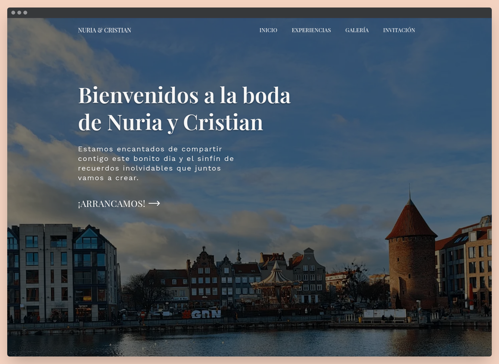

<div align="center">
<h2>
    Boda Cristian y Nuria 💒
</h2>

<div align="center">


</div>

</img>

¡Bienvenidos a la página oficial de la boda de Cristian y Nuria!

## ⚙️ Frontmatter de las Experiencias

```yaml
---
# Campos obligatorios
title: "Título de la experiencia"
description: "Descripción detallada de la experiencia"
heroImage: "./ejemplo/hero.jpg"
clients: ["Cliente 1", "Cliente 2"]
location: "Ubicación de la experiencia"
date: 2025-06-25
images:
  [
    ["./ejemplo/img1.jpg"],
    ["./ejemplo/img2-1.jpg", "./ejemplo/img2-2.jpg"],
    ["./ejemplo/img3-1.jpg", "./ejemplo/img3-2.jpg", "./ejemplo/img3-3.jpg"],
  ]
order: 1

# Campos opcionales
headerImage: "./ejemplo/header.jpg"
draft: false
---
```

> Nota: Cada array dentro de `images` debe contener 1, 2 o 3 imágenes.
